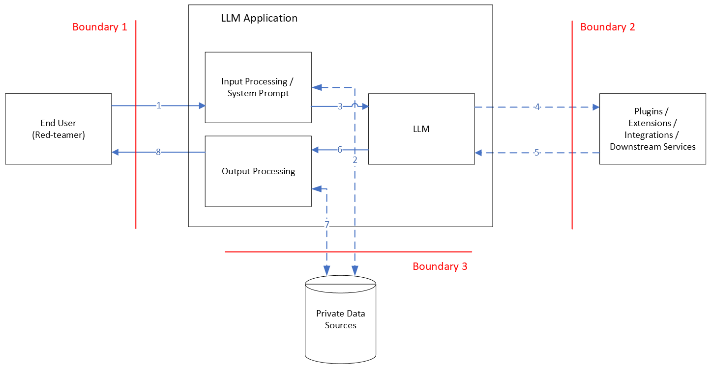

# Threat Modelling

The following diagram represents a data flow diagram for a hypothetical LLM application:

## Data Flows

With reference to the DFD, the data flows are described as follows:
1. The prompt from the user (red-teamer) into the application
2. (Optional) If the application implements Retrieval Augmented Generation (RAG), the application looks up information related to the prompt from a vector database using semantic search. This information is joined to the initial prompt.
3. After the addition of system prompting and the application of any input processing guardrails the final prompt is submitted to the model.
4. (Optional) The model may call external downstream services to assist it to respond to the prompt.
5. Response from the downstream services.
6. The raw response from the model to the application.
7. (Optional) Again, if the application uses RAG, the raw response may be 'grounded' against data from private sources.
8. Finally, after applying any output processing, the response is returned to the user.

## Trust Boundaries

Within this hypothetical application architecture, three trust boundaries are considered:
1. The prompt / response boundary between the user and the LLM application. This is the primary attack surface for LLM red-teaming.
2. The boundary between the model and any external / downstream services. This boundary provides an opportunity for "Insecure Plugin Design" attacks (OWASP LLM07), and traditional SSRF attacks. If the red-teamer is able to control the responses from the downstream services ("resource control"), this represents a vector for indirect prompt injection.
3. The boundary between the LLM application and any private data sources. This boundary represents an opportunity for "Sensitive Information Disclosure" (OWASP LLM06) if authorisation controls are not implemented correctly. If the red-teamer is able to control the data returned from the private data sources ("resource control"), this boundary also represents a vector for indirect prompt injection.

## Applicable Threats

With consideration to the OWASP Top 10 for LLMs, NIST's Adversarial Machine Learning guidance, and your favourite threat modelling approach, the following list details the key threats that will be addressed in this repo:
### 1. Making a request of an LLM that should not be allowed.

This is the essence of "Prompt injection" (OWASP LLM01) / Jailbreaking. The objective is to bypass controls or restrictions applied to user input through system prompts or other means. 
Indirect prompt injection also fits here.

### 2. Receiving a response from an LLM that should not be allowed.

If you are able to get the prompt that you want to the LLM, this is the family of responses that you are looking for.
Problematic responses could broadly include:
- "Sensitive information disclosure" (OWASP LLM06): It is sometimes possible to extract PII and other sensitive data that was used for model training or fine-tuning. 
- Harmful responses: This could include toxic, hateful, offensive, triggering, illegal, discriminatory or biased responses
- Off-topic / off-brand responses: Where an LLM application is intended for a specific purpose (e.g. Customer service enquiries), these responses are anything beyond its intended use-cases (e.g. Providing political opinions)
- Factually incorrect responses: This class could include deliberate misinformation, or unintended errors or 'hallucinations'

### 3. Triggering an action from an LLM that should not be allowed.

If the LLM application implements some form of action agents or downstream services, it may be possible to have it execute actions beyond its intended use-cases (and of benefit to the red-teamer.) 
This may be manifest as the following:
- "Excessive agency" (OWASP LLM08)
- Privilege escalation
- Server-side request forgery

### 4. "Model denial of service" (OWASP LLM04)

It may be possible prompt the LLM application in such a way as to consume a large amount of resources, resulting in a decline in performance for other users.

### 5. Model "denial of wallet"

This threat is similar to denial of service, but instead of impacting on system performance, the adversary'y objective is to accrue processing costs against the operators of the LLM application.

